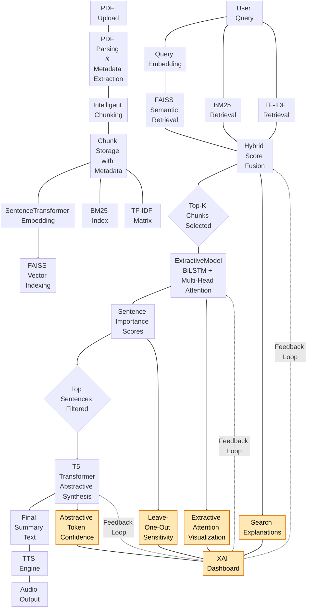

### AuraLearn API

Professional document intelligence API for PDF processing, summarization, and audio generation.

### Key capabilities

- **PDF ingestion** with robust chunking and metadata extraction
- **Extractive summarization** using a BiLSTM-based model
- **Abstractive summarization** using a fine‑tuned T5 model
- **Audiobook generation** via high-quality TTS
- **End-to-end pipeline** from document upload to audio output

### Architecture

